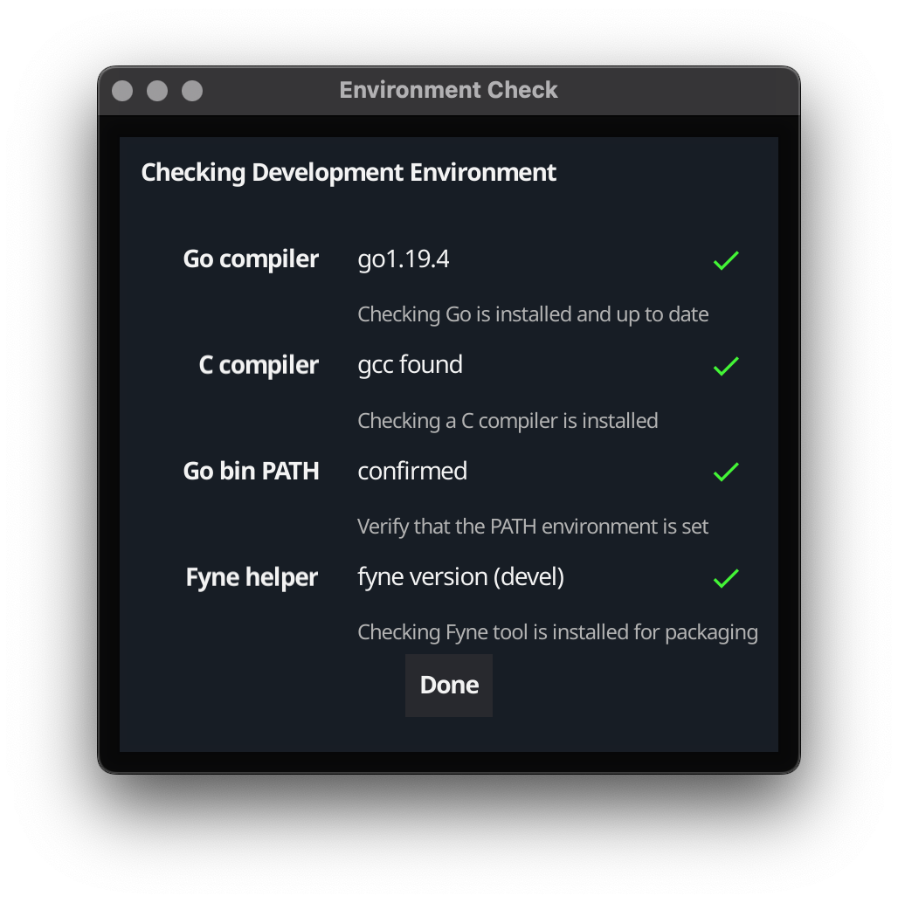

# Fyne Setup

The setup repository aims to help developers get their environment set up.

You can run the interface to see if your computer is ready to go!

    go install fyne.io/setup@latest
    $(go env GOPATH)/bin/setup

You should see something like the following screenshot:

If your setup is not ready then it will give hints about how
to complete the configuration.